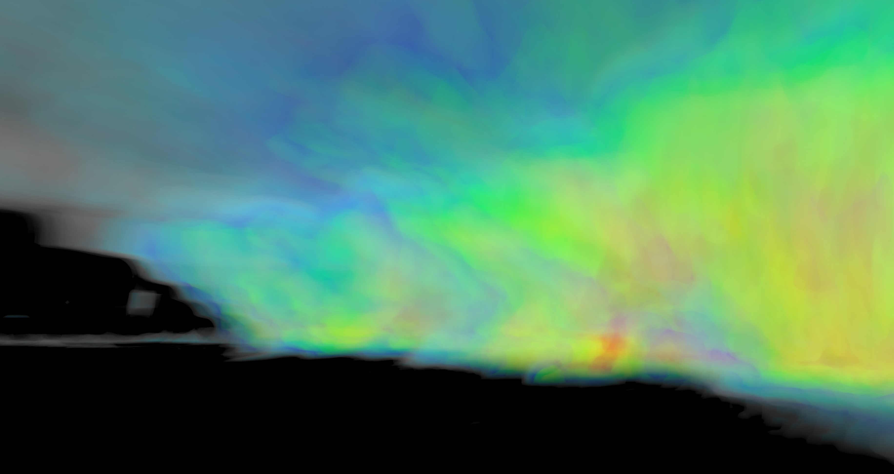

# OpenStorm Radar

OpenStorm radar is a free and open source 3d radar viewer. It uses Unreal Engine 5 as the base. Using a custom volumetric ray marching shader, entire radar volumes can be displayed.

## Demo Video

## Download
You can find a pre-built download [here](https://github.com/JordanSchlick/OpenStorm/releases/latest/)

## Community / Contact
Discord server invite [https://discord.gg/K3aU2hEYvJ](https://discord.gg/K3aU2hEYvJ)

## Features
* Full 3D level 2 radar
* Multithreaded data loading
* No limit on number of files it can browse through
* Load files in real time as they are updated
* Display base radar products (Reflectivity, Radial Velocity, Spectrum Width, Correlation Coefficient, Differential Reflectivity, Differential Phase Shift)
* Display derived products  (De-aliased Velocity, Storm Relative Velocity, Rotation)
* Interpolation in space and time
* Linux and Windows support
* NEXRAD and ODIM H5 radar data support
* VR headset viewing

## Getting data
NEXRAD and European ODIM H5 radar data are currently supported.  
You can get NEXRAD data from
* https://github.com/JordanSchlick/radar-data to download data in real time.
* https://s3.amazonaws.com/noaa-nexrad-level2/index.html for historical data.

## Building
1. Install Unreal Engine 5.2 and its dependencies
2. Clone the repo `git clone https://github.com/JordanSchlick/OpenStorm.git`
3. Get submodules `git submodule update --init --recursive`
4. Right click on the uproject file and generate visual studio project files
5. Open the visual studio solution file
6. Build the project in visual studio by hitting ctrl+shift+b
7. Open the project in unreal engine

To build a standalone build, select package project within the desired platform under the Platforms dropdown.

To pull the latest changes to an existing copy of the repo use `git pull --recurse-submodules`  

Some of the larger data files are not included in the repository. They can be retrieved out of the latest release. The files can be found in the OpenStorm folder inside the release builds. The files can then be moved into the following locations in this project.  
Elevation data: `Content/Data/elevation.bin.gz`  
Satellite imagery: `Content/Data/Map/ImageryOnly.tar`  
The demo radar files in: `Content/Data/Demo/`  

The source code for reading HDF5 files and by extension european ODIM radar data is stored in a separate repository. It can be optionally installed by cloning `https://github.com/JordanSchlick/hdf5` into `OpenStorm/Source/OpenStorm/Radar/Deps` with `cd Source/OpenStorm/Radar/Deps` and then `git clone https://github.com/JordanSchlick/hdf5.git`  
It has around 375 c files that will increase compile time. Due to the significant increase in compile time and the chances for incompatibilities, it is completely optional.

## Development
### Using VS Code
Create a symlink to your Unreal Engine installation beside this repository to enable intellisense and building from vs code. The link should be placed one folder up from this readme.  
Windows example(needs admin privileges): `mklink /D UnrealEngine "C:\files\Epic\UE_5.2\Engine"`  
Linux example: `ln -s "/path/to/UE/Engine" UnrealEngine`  
### Coding Guidelines
In general just try to be consistent with existing code. The following guidelines are should be followed. You may be asked to conform if your code significantly violates them.
* The Radar source directory and everything under it must be self contained and can not have dependencies on Unreal Engine. It is meant to be a separable library that can be used outside of OpenStorm. There are currently node and python bindings available for it.
* Indentation uses tabs.
* Class functions are upper case while variables are lower case.
* Try to keep as few includes as possible in .h files to reduce compile times.

